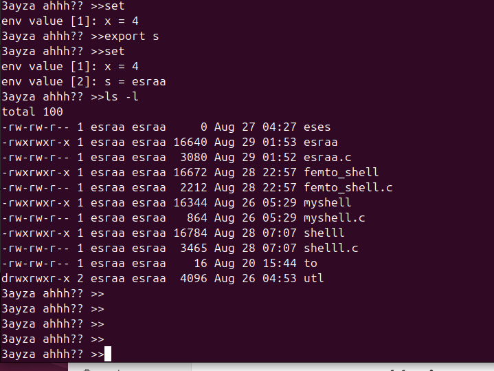

 # linux-femto-Shell

Implementing a simple linux shell that supports some features of the linux bash shell:
    - Executing external commands using fork and exec
    - Local and env variables where the env variables are passed to any child created by your shell while the local 
        variables are not passed to the children.

